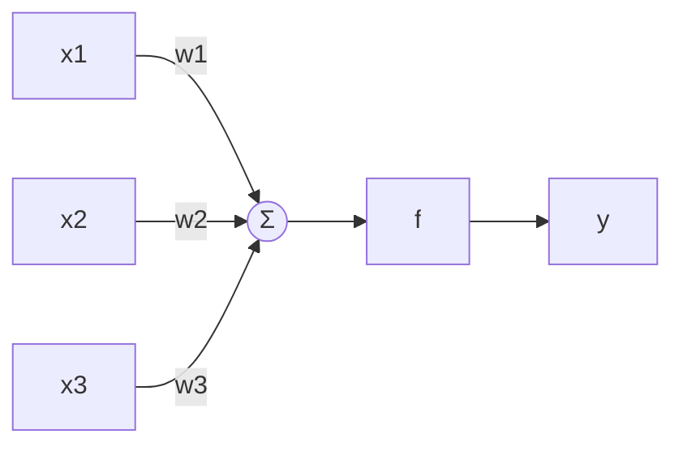
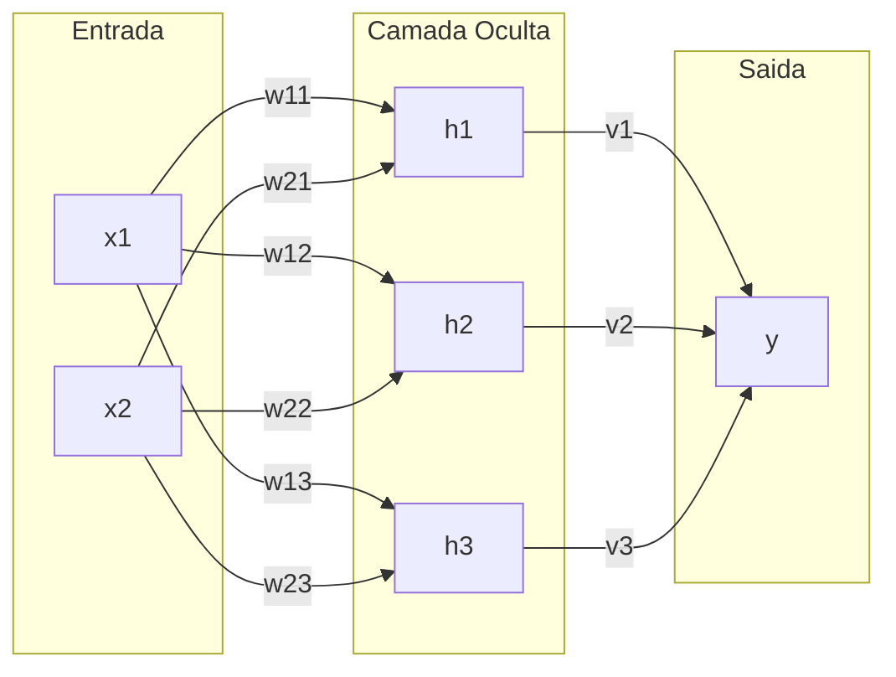

# Redes Neurais Artificiais

## Exercícios

**Questão 1.** A arquitetura do perceptron de uma camada com três entradas pode ser representada abaixo

Se pensarmos as entradas e pesos como vetores $\textbf{x}$ e $\textbf{w}$, a saída pode ser calculada como

$$y = f(\texttt{x} \cdot \texttt{w})$$

Em que $(\cdot)$ é o produto escalar entre vetores e $f$ a função de ativação. 

Ou, no formato, matricial

$$
\mathbf{y}_{1,1} = \mathbf{x}^T \mathbf{w}
$$

Sendo assim, calcule a saída dessa rede neural, dado que 

$$
\mathbf{x} =
\begin{bmatrix}
1.0 & 7.0 & 5.0
\end{bmatrix}^T
\quad
\mathbf{w} =
\begin{bmatrix}
0.8 & 0.1 & 0.0
\end{bmatrix}^T
$$

E a função de ativação $f(x)=\texttt{stepfunc}(x)$

**Questão 2.** Dada a tabela-verdade do operador lógico AND, apresentada a seguir

| x₁ | x₂ | y |
|----|----|---|
| 0  | 0  | 0 |
| 0  | 1  | 0 |
| 1  | 0  | 0 |
| 1  | 1  | 1 |

Utilize as entradas dessa tabela para calcular o erro médio absoluto (EMA) para cada um dos conjuntos de pesos abaixo.

a) $w_1=w_2=0.0$

b) $w_1=w_2=0.1$

c) $w_1=w_2=0.5$

**Questão 3.** Uma arquitetura do perceptron de múltiplas camadas com uma camada oculta e duas entradas pode ser feita da seguinte forma

Considerando

$$
\mathbf{w}_1^T =
\begin{bmatrix}
w_{11} & w_{12} & w_{13}
\end{bmatrix}
\quad
\mathbf{w}_2^T =
\begin{bmatrix}
w_{21} & w_{22} & w_{23}
\end{bmatrix}
$$

Temos as matrizes de pesos da rede neural

$$
\mathbf{W} =
\begin{bmatrix}
\mathbf{w}_1^T \\
\mathbf{w}_2^T
\end{bmatrix}
\qquad
\mathbf{v} =
\begin{bmatrix}
v_1 & v_2 & v_3
\end{bmatrix}^T
$$

Seja $\mathbf{H}=\mathbf{F}(\mathbf{x}^T\mathbf{W})$, a saída será dada por

$$
y=f(\mathbf{H}^T\mathbf{v})
$$

Definimos $\mathbf{F}(\texttt{x})$ como a matriz resultante após aplicar a função de ativação $f$ em cada entrada de $\texttt{x}$

Sendo assim, calcule a saída dessa rede neural, dado que 

$$
\mathbf{x} =
\begin{bmatrix}
0.0 & 0.0
\end{bmatrix}^T
\quad
\mathbf{W} =
\begin{bmatrix}
-0.424 & -0.740 & -0.961 \\
-0.358 & -0.577 & -0.469
\end{bmatrix}
\quad
\mathbf{v} =
\begin{bmatrix}
-0.017 & -0.893 & 0.148
\end{bmatrix}^T
$$

E a função de ativação $f(x) = \texttt{sigmoid}(x)$

**Questão 4.** Dada a tabela-verdade do operador lógico XOR, apresentada a seguir

| x₁ | x₂ | y |
|----|----|---|
| 0  | 0  | 0 |
| 0  | 1  | 1 |
| 1  | 0  | 1 |
| 1  | 1  | 0 |

Utilize as entradas dessa tabela e a mesma arquitetura de perceptron da Questão 3 para calcular as saídas da rede neural e o erro médio absoluto 
