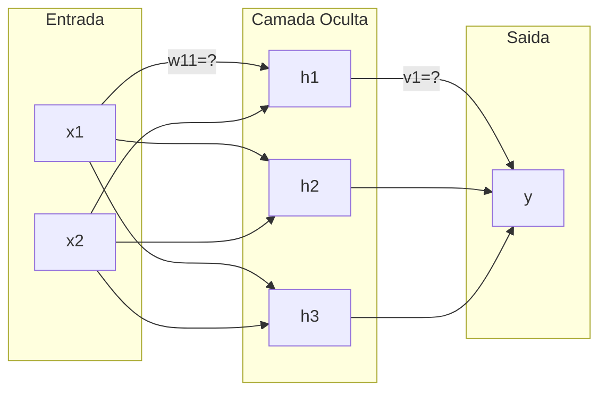

# Redes Neurais Artificiais

## Exercícios

**Questão 1.** A arquitetura do perceptron de uma camada com três entradas pode ser representada abaixo


Se pensarmos as entradas e pesos como vetores $\textbf{x}$ e $\textbf{w}$, a saída pode ser calculada como

$$y = f(\texttt{x} \cdot \texttt{w})$$

Em que $(\cdot)$ é o produto escalar entre vetores e $f$ a função de ativação. 

Ou, no formato, matricial

$$
\mathbf{y}_{1,1} = \mathbf{x}^T \mathbf{w}
$$

Sendo assim, calcule a saída dessa rede neural, dado que 

$$
\mathbf{x} =
\begin{bmatrix}
1.0 & 7.0 & 5.0
\end{bmatrix}^T
\quad
\mathbf{w} =
\begin{bmatrix}
0.8 & 0.1 & 0.0
\end{bmatrix}^T
$$

E a função de ativação $f(x)=\texttt{stepfunc}(x)$

**Questão 2.** Dada a tabela-verdade do operador lógico AND, apresentada a seguir

| x₁ | x₂ | y |
|----|----|---|
| 0  | 0  | 0 |
| 0  | 1  | 0 |
| 1  | 0  | 0 |
| 1  | 1  | 1 |

Utilize as entradas dessa tabela para calcular o erro médio absoluto (EMA) para cada um dos conjuntos de pesos abaixo.

a) $w_1=w_2=0.0$

b) $w_1=w_2=0.1$

c) $w_1=w_2=0.5$

**Questão 3.** Uma arquitetura do perceptron de múltiplas camadas com uma camada oculta e duas entradas pode ser feita da seguinte forma


Considerando

$$
\mathbf{w}_1^T =
\begin{bmatrix}
w_{11} & w_{12} & w_{13}
\end{bmatrix}
\quad
\mathbf{w}_2^T =
\begin{bmatrix}
w_{21} & w_{22} & w_{23}
\end{bmatrix}
$$

Temos as matrizes de pesos da rede neural

$$
\mathbf{W} =
\begin{bmatrix}
\mathbf{w}_1^T \\
\mathbf{w}_2^T
\end{bmatrix}
\qquad
\mathbf{v} =
\begin{bmatrix}
v_1 & v_2 & v_3
\end{bmatrix}^T
$$

Seja $\mathbf{H}=\mathbf{F}(\mathbf{x}^T\mathbf{W})$, a saída será dada por

$$
y=f(\mathbf{H}^T\mathbf{v})
$$

Definimos $\mathbf{F}(\texttt{x})$ como a matriz resultante após aplicar a função de ativação $f$ em cada entrada de $\texttt{x}$

Sendo assim, calcule a saída dessa rede neural, dado que 

$$
\mathbf{x} =
\begin{bmatrix}
0.0 & 0.0
\end{bmatrix}^T
\quad
\mathbf{W} =
\begin{bmatrix}
-0.424 & -0.740 & -0.961 \\
-0.358 & -0.577 & -0.469
\end{bmatrix}
\quad
\mathbf{v} =
\begin{bmatrix}
-0.017 & -0.893 & 0.148
\end{bmatrix}^T
$$

E a função de ativação $f(x) = \texttt{sigmoid}(x)$

**Questão 4.** Dada a tabela-verdade do operador lógico XOR, apresentada a seguir

| x₁ | x₂ | y |
|----|----|---|
| 0  | 0  | 0 |
| 0  | 1  | 1 |
| 1  | 0  | 1 |
| 1  | 1  | 0 |

Utilize as entradas dessa tabela e a mesma rede neural da Questão 3 para calcular as saídas da rede neural e o erro médio absoluto 

**Questão 5.** Em uma rede neural densa, o parâmetro delta ($\delta$) representa o erro propagado em cada neurônio. Ele mede o quanto a saída de um neurônio contribuiu para o erro propagado da sua camada atual para a próxima camada.

Na rede neural da Questão 3, para uma entrada 

$$
\mathbf{x} =
\begin{bmatrix}
x_1 & x_2
\end{bmatrix}^T
$$

O erro propagado da camada oculta para a camada de saída é proporcional ao *delta de saída*, calculado por

$$
\delta^{(saida)}=(y_{previsto}-y_{real})\dot{y}_{previsto}
$$

Com $y_{previsto}=f(x_0)$ e $\dot{y}_{previsto}=\dot{f}(x_0)$ e $x_0 = \mathbf{H}^T\mathbf{v}$

O erro propagado da camada de entrada para a camada oculta é proporcional ao *delta da camada oculta*, calculado por

$$
\delta^{(oculta)} = \delta^{(saida)} \cdot [\dot{\textbf{F}}(\textbf{H})\circ\textbf{v}]
$$

Definimos $\dot{\mathbf{F}}(\textbf{x})$ como a matriz resultante após aplicar a derivada da função de ativação $f$ em cada entrada de $\textbf{x}$, e $\mathbf{C}=\mathbf{A}\circ\mathbf{B}$ como a multiplicação ponto a ponto ($c_i=a_i \cdot b_i$)

Observe que $\delta^{(oculta)}$ é um vetor porque cada neurônio da camada oculta precisa ter o seu próprio valor de erro propagado. O $\delta^{(saida)}$, por sua vez, é um escalar porque na arquitetura que nos baseamos temos apenas um neurônio de saída.

Utilize a arquitetura de rede neural da Questão 3 para calcular os parâmetros $\delta^{(saida)}$ e $\delta^{(oculta)}$ para cada uma das entradas da tabela verdade do operador XOR.

**Questão 6.** O ajuste de pesos de uma rede neural densa pode ser realizado pelas seguintes etapas

1. Calcular as ativações dos neurônios da(s) camada(s) oculta(s) e depois da camada de saída (processo *feed-forward*)
2. Calcular o erro (delta) da camada de saída e, em seguida, o erro (delta) das camadas ocultas.
3. Atualizar os pesos da camada de saída e depois da camada oculta

Observe que, nos passos 2 e 3, o algoritmo percorre a rede no sentido inverso ao do feed-forward, propagando o erro da saída em direção às camadas anteriores para ajustar os pesos com base nos deltas calculados e nas entradas.

Por esse motivo, esse algoritmo é denominado backpropagation. 

Para exemplificar, a seguir um pseudocódigo que atualiza os pesos `w11` e `v1`



```c
grad_v1 := 0.0
grad_w11 := 0.0

para cada entrada x := (x1, x2)

    // Feed-forward: calculo das ativações dos neurônios
    calcule h1
    calcule y

    // Backpropagation: calculo dos deltas da camada de saida e do neurônio da camada oculta
    calcule δ_y
    calcule δ_h1

    // Acúmulo dos gradientes
    grad_v1  += δ_y  * h1
    grad_w11 += δ_h1 * x1

// Atualização com momento (0 ≤ α < 1) e taxa de aprendizagem (0 < η < 1)
v1  := α * v1  - η * grad_v1
w11 := α * w11 - η * grad_w11
```

Implemente o *backpropagation* para ajustar iterativamente os pesos das seguintes redes neurais até que o erro médio absoluto convirja para um valor próximo de zero.

a) Operador XOR com a arquitetura da rede neural da Questão 03 e os pesos inciais apresentados nas matrizes $\textbf{W}$ e $\textbf{v}$

b) Operador AND com a arquitetura da rede neural da Questão 02 e pesos iniciais $w_1=w_2=0.0$

b) Operador OR com a arquitetura da rede neural da Questão 02 e pesos iniciais $w_1=w_2=0.0$
